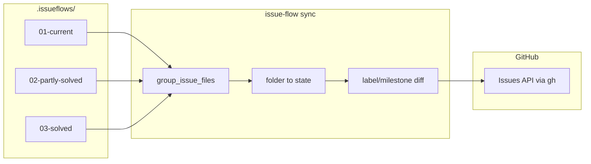

# Issue #102 plan: GitHub Actions sync for `.issueflows/` state

## Goal

Ship a **reusable GitHub Actions workflow** plus a **testable CLI command** that, on push (or manual dispatch), syncs each tracked issue's **folder location** under `.issueflows/` to GitHub — primarily via managed `status:*` labels, with optional milestone mapping — so teams can see current / parked / solved state on GitHub without hand-editing labels.

## Constraints

- **Source of truth:** `.issueflows/` folder placement wins; sync is **one-way** (files → GitHub) for v1.
- **Reuse tracking rules:** Issue discovery and grouping must go through [`tracking.group_issue_files`](../../src/issue_flow/tracking.py) and the existing `01` / `02` / `03` folder names from [`Settings`](../../src/issue_flow/config.py) — do not invent a parallel scanner.
- **Label safety:** Only add/remove labels under a configurable prefix (default `status:`). Never strip unrelated user labels (e.g. `yolo`, `bug`).
- **No silent GitHub closes:** Closing issues when a group lands in `03-solved-issues/` is **opt-in** (default off) — local "solved" often means "archived from agent workflow", not "close the GitHub ticket".
- **Headless / CI:** Sync must work non-interactively with `GITHUB_TOKEN` or `gh` auth already present (GHA runners).
- **Scope:** Labels-first deliverable; milestone mapping is optional config, not a second implementation path.
- **Sibling #101:** Git-hook file moves (#101) are a separate trigger for the same domain — share `sync.py` logic, do not fold hook install into this issue.

### Prior art

| Hit | Module / location | Reuse |
| --- | --- | --- |
| Issue file grouping + Done marker | `tracking.group_issue_files`, `IssueGroup`, `file_marks_done` | Scan all three lifecycle folders; map folder name → sync state |
| Focus / lifecycle stage (read-only) | `agent.run_state`, `tracking.resolve_focus` | Reference only — sync cares about **folder**, not plan/start stage |
| GitHub read helpers | `gitutils.gh_issue_meta`, `gh_issue_list_meta`, `gh_issue_state` | Read current labels/state before applying diffs |
| Label semantics in workflow | [label-driven-flows.md](../04-designs-and-guides/label-driven-flows.md) | `yolo` and other labels must survive sync |
| Existing CI workflow | [`.github/workflows/ci.yml`](../../.github/workflows/ci.yml) | Pattern for `checkout`, `setup-uv`, permissions |
| Toolbox | `00-tools/verify_scaffold.py` | No sync helper yet; new logic belongs in package, not a one-off script |
| Graph (Community 0 / gitutils tests) | `graphify-out/GRAPH_REPORT.md` | Confirms `gitutils` + `tracking` as the right adjacency — no existing sync module |

## Approach

### 1. Core sync engine (`src/issue_flow/sync.py`)

Build a pure function layer:

1. **Collect** — For each of `01-current-issues`, `02-partly-solved-issues`, `03-solved-issues`, call `tracking.group_issue_files`. Union by issue number; if the same `N` appears in multiple folders (shouldn't happen), log a warning and prefer `01` > `02` > `03`.
2. **Map** — Folder → sync state:
   - `01-current-issues` → `current`
   - `02-partly-solved-issues` → `parked`
   - `03-solved-issues` → `solved`
3. **Derive desired GitHub mutations** per issue:
   - **Labels (default on):** Ensure exactly one managed label among `{prefix}current`, `{prefix}parked`, `{prefix}solved` (default prefix `status:`). Remove sibling managed labels; leave all other labels untouched.
   - **Milestones (default off):** When enabled in config, set milestone title from a three-entry map (e.g. `IF current` / `IF parked` / `IF solved`). Skip if milestone doesn't exist (report, don't create).
   - **Close (default off):** When `close_on_solved` is true and state is `solved`, call `gh issue close` only if the issue is open.
4. **Apply** — Dry-run by default in tests; `--apply` (or default apply in GHA) executes via new `gitutils` helpers wrapping `gh issue edit` / `gh issue close`.
5. **Report** — Human table or `--json` payload: `{number, state, labels_added, labels_removed, milestone, closed, skipped, errors}`.

Expose as **`issue-flow sync`** Typer command (top-level, alongside `init`/`update` — matches how consumers invoke the tool in CI). Optional alias `issue-flow agent sync` if we want parity with other agent subcommands; pick one primary surface and test it.

### 2. Configuration (`.issueflows/config.toml`)

Add `[issueflow.sync]` keys (read via `modes.py` / `config.py`, same pattern as `label_flows`):

| Key | Default | Purpose |
| --- | --- | --- |
| `enabled` | `true` | Master switch (workflow can skip when false) |
| `label_prefix` | `"status:"` | Managed label namespace |
| `labels` | `true` | Toggle label sync |
| `milestones` | `false` | Toggle milestone sync |
| `milestone_map` | `{current="", parked="", solved=""}` | Title → milestone (empty = skip) |
| `close_on_solved` | `false` | Opt-in GitHub close |

Env fallbacks: `ISSUEFLOW_SYNC_*` mirrors for CI overrides. Document in README; `issue-flow config add` can seed defaults on `init`/`update` (template change).

### 3. `gitutils` extensions

Add thin wrappers (mocked in tests):

- `gh_issue_edit(number, *, add_labels, remove_labels, milestone, repo, cwd)`
- `gh_issue_close(number, repo, cwd)` (only when config allows)

Keep JSON parsing/error handling consistent with existing `gh_issue_meta`.

### 4. Reusable GitHub Actions workflow

Ship [`.github/workflows/issue-flow-sync.yml`](../../.github/workflows/issue-flow-sync.yml) as a **`workflow_call`** reusable workflow in this repo:

```yaml
# inputs: project_root ('.'), dry_run (bool), label_prefix (optional override)
# permissions: contents: read, issues: write
# steps: checkout → setup-uv → uv sync → uv run issue-flow sync [--apply]
```

Consumers add a thin caller in their repo:

```yaml
on:
  push:
    paths: ['.issueflows/**']
jobs:
  sync:
    uses: jepegit/issue-flow/.github/workflows/issue-flow-sync.yml@<tag>
    secrets: inherit
```

For v1, **pin to a release tag** in docs; `@main` only for this repo's dogfood.

### 5. Dogfood + docs

- **This repo:** Add [`.github/workflows/issueflow-sync.yml`](../../.github/workflows/issueflow-sync.yml) caller that triggers on `.issueflows/**` pushes to `main` (and optionally PRs) — satisfies "example project uses the workflow successfully".
- **README:** Extend [Future plans](https://github.com/jepegit/issue-flow/blob/main/README.md#future-plans) bullet into a short "GitHub Actions sync" section: enable steps, config keys, required `issues: write`, label bootstrap note (`gh label create` once or workflow creates missing `status:*` labels — **recommend documenting manual/bootstrap** for v1 to avoid surprise label creation).
- **Optional scaffold:** Template a caller workflow snippet under `src/issue_flow/templates/` for `issue-flow init` — only if trivial; otherwise README-only for v1 to keep scope tight.

### 6. Label bootstrap

On first run, managed labels may not exist. v1 behaviour:

- **Attempt apply**; if `gh` reports unknown label, collect failures and print a one-time bootstrap hint (`gh label create 'status:current' --color …` ×3).
- Defer auto-create to a follow-up unless trivial — avoids permission surprises on forks.

### Data flow



## Files to touch

| Path | Change |
| --- | --- |
| `src/issue_flow/sync.py` | **New** — scan, plan, apply, report |
| `src/issue_flow/gitutils.py` | `gh issue edit` / close helpers |
| `src/issue_flow/cli.py` | `sync` command registration |
| `src/issue_flow/config.py` + `modes.py` | Read `[issueflow.sync]` settings |
| `tests/test_sync.py` | **New** — folder mapping, label diff, dry-run, config |
| `tests/test_cli.py` | Smoke test for `issue-flow sync --help` / `--json` dry-run |
| `.github/workflows/issue-flow-sync.yml` | **New** — reusable `workflow_call` workflow |
| `.github/workflows/issueflow-sync.yml` | **New** — dogfood caller |
| `README.md` | Setup + configuration section |
| `src/issue_flow/templates/...` | Optional: config.toml defaults + docs snippet on `update` |
| `.issueflows/01-current-issues/issue102_status.md` | Created during `/iflow-start`, not now |

## Test strategy

```bash
uv run pytest tests/test_sync.py tests/test_cli.py -v   # targeted
uv run pytest                                          # full suite before close
uv run ruff check src/ tests/
```

Tests use `tmp_path` trees with fake `issue<N>_status.md` files in each folder and monkeypatched `gitutils` — no live `gh` calls. Cover:

- Each folder maps to the right managed label
- Moving `issue5_*` from `01` → `03` removes `status:current`, adds `status:solved`
- Unrelated labels (`yolo`) preserved
- `close_on_solved=false` never closes
- Duplicate issue in two folders → warning + precedence
- `--dry-run` emits JSON without calling `gh`

## Open questions

Needs your call before `/iflow-start`:

1. **Label vs milestone vs both** — Plan defaults to **labels on, milestones off, both configurable**. Accept, or require milestones in v1?
2. **Close on solved** — Plan defaults to **`close_on_solved = false`**. Enable by default for your workflow?
3. **One-way vs bidirectional** — Plan is **one-way (files → GitHub)**; bidirectional deferred. OK?
4. **Auto-create missing `status:*` labels** — Plan documents manual bootstrap; workflow does not auto-create. Prefer auto-create in CI?
5. **Dogfood trigger** — Sync on push to `main` when `.issueflows/**` changes only, or also on PRs to this repo?

## Scope check

Single cohesive feature (CLI + reusable workflow + docs + tests). Milestone sync and scaffold template are optional slices inside this plan, not separate issues. If milestones or bidirectional sync are must-haves for v1, say so — may warrant trimming label-only polish instead of expanding scope.
