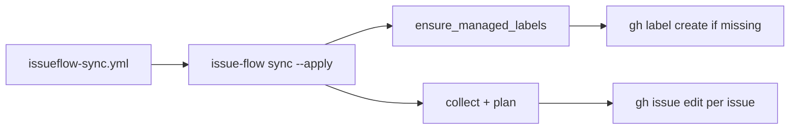

# Issue #166 plan: Fix dogfood `issueflow-sync` workflow

## Goal

Make the dogfood [`.github/workflows/issueflow-sync.yml`](../../.github/workflows/issueflow-sync.yml) workflow succeed on push to `main` when `.issueflows/**` changes, by ensuring managed `status:*` labels exist before `issue-flow sync --apply` runs.

## Constraints

- **Root cause confirmed:** Latest run (`29242355825`) fails with `'status:solved' not found` for every solved issue in `03-solved-issues/`. Repo has no `status:*` labels yet (only defaults + `yolo` + `epic`).
- **v1 deferral:** Issue #102 shipped manual bootstrap + `bootstrap_hint()` but no auto-create — dogfood never ran the bootstrap step.
- **Label safety unchanged:** Only create labels under the configured prefix (`status:` by default). Never touch unrelated labels.
- **Headless / CI:** Must work non-interactively with `GITHUB_TOKEN` / `gh` on GHA runners (`issues: write` already granted).
- **Back-compat:** Manual `gh label create` bootstrap remains valid; auto-create is additive.
- **Scope:** Fix sync bootstrap + dogfood green. No bidirectional sync, no milestone work, no workflow trigger changes.

### Prior art

| Hit | Module / location | Reuse |
| --- | --- | --- |
| Sync engine + bootstrap hint | [`sync.py`](../../src/issue_flow/sync.py) — `bootstrap_hint()`, `managed_labels()`, `run_sync()` | Extend with `ensure_managed_labels()`; hint already has colors |
| GitHub wrappers | [`gitutils.py`](../../src/issue_flow/gitutils.py) — `gh_issue_edit`, `gh_issue_close` | Add `gh_label_create` / `gh_label_exists` (same error-handling style) |
| #102 plan open Q4 | [issue102_plan.md](../03-solved-issues/issue102_plan.md) | Explicitly deferred auto-create — this issue closes that gap |
| Reusable + dogfood workflows | [issue-flow-sync.yml](../../.github/workflows/issue-flow-sync.yml), [issueflow-sync.yml](../../.github/workflows/issueflow-sync.yml) | Dogfood caller stays thin; logic lives in CLI |
| Tests | [`tests/test_sync.py`](../../tests/test_sync.py) | Add bootstrap coverage with monkeypatched `gitutils` |
| README bootstrap section | [`README.md`](../../README.md) § GitHub Actions sync | Update to document auto-create + config toggle |
| Toolbox | `00-tools/verify_scaffold.py` | No sync helper; package code is right place |
| Graph (Community sync) | `graphify-out/GRAPH_REPORT.md` | `sync.py` + `gitutils` cluster — no parallel module |

## Approach

### 1. Auto-create missing managed labels (`sync.py` + `gitutils.py`)

Before applying per-issue plans in `run_sync()` (when `apply=True` and `config.labels=True`):

1. **`ensure_managed_labels(prefix, project_root, repo)`** — for each of `status:current`, `status:parked`, `status:solved`:
   - Check existence via `gh label list` (or `gh api repos/.../labels/...`).
   - If missing, `gh label create '<name>' --color <hex>` using colors already encoded in `bootstrap_hint()`.
   - Idempotent: existing labels → no-op.
2. **`gh_label_create` / `gh_label_exists`** in `gitutils.py` — thin `subprocess` wrappers, consistent with `gh_issue_edit`.
3. **Config toggle** — `[issueflow.sync] bootstrap_labels = true` (default **on**). When `false`, keep current behaviour (fail + print `bootstrap_hint`).

### 2. Dogfood verification

After implementation:

```bash
uv run issue-flow sync --json          # dry-run still works
uv run issue-flow sync --apply --json  # should succeed locally (creates labels, applies)
```

No workflow YAML change required if CLI handles bootstrap — dogfood caller already runs `uv run issue-flow sync --apply`.

### 3. Docs touch-up

- **README:** Note that `bootstrap_labels` defaults to `true` and auto-creates missing `status:*` labels on `--apply`; manual `gh label create` still documented for teams that prefer pre-provisioning or `bootstrap_labels = false`.
- **HISTORY.md:** One-line entry when closing (not now).

### Data flow



## Files to touch

| Path | Change |
| --- | --- |
| `src/issue_flow/gitutils.py` | `gh_label_exists`, `gh_label_create` helpers |
| `src/issue_flow/sync.py` | `ensure_managed_labels()`, call from `run_sync()`; extract shared label colors from `bootstrap_hint` |
| `src/issue_flow/modes.py` | `DEFAULT_SYNC_BOOTSTRAP_LABELS = True` |
| `src/issue_flow/config.py` / `modes.py` | Read `bootstrap_labels` from `[issueflow.sync]` |
| `tests/test_sync.py` | Tests: creates missing labels; skips when exist; respects `bootstrap_labels=false` |
| `README.md` | Document `bootstrap_labels` + auto-create behaviour |

## Test strategy

```bash
uv run pytest tests/test_sync.py -v   # targeted
uv run pytest                         # full suite before close
uv run ruff check src/ tests/
```

Monkeypatch `gitutils.gh_label_exists` / `gh_label_create` / `gh_issue_edit` — no live `gh` in unit tests.

Manual smoke (optional during `/iflow-start`):

```bash
uv run issue-flow sync --apply --json
gh label list | grep status
```

## Open questions

1. **Default `bootstrap_labels`** — Plan defaults **on** (fixes dogfood + new adopters out of box). Prefer **off** (manual bootstrap only)?
2. **One-shot repo fix** — OK to run `sync --apply` locally as part of `/iflow-start` to create labels + label solved issues on this repo? (Needed for dogfood to pass on next `.issueflows/` push anyway.)
