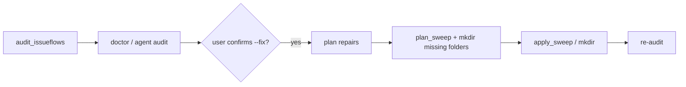

# Issue #47 — Plan

## Goal

Define what a **dirty** `.issueflows/` tree means, expose deterministic
**audit** and **repair** commands on the CLI, and scaffold an agent skill so
`/iflow-doctor` can run the same checks and safe fixes that humans use.

## Constraints

- **Templates are source of truth** for scaffolded skills/commands — edit
  `src/issue_flow/templates/`, not rendered `.cursor/` copies.
- **CLI is optional fast path** — skills must keep manual fallback steps
  ([agentic-cli.md](.issueflows/04-designs-and-guides/agentic-cli.md)).
- **Mechanical only** — audit/repair promote deterministic filesystem rules;
  no LLM judgment in Python.
- **Safe by default** — repairs are previewable (`--dry-run`), never delete
  issue markdown; only move whole `issue<N>_*` groups between lifecycle folders
  (same contract as `agent sweep`).
- **Back-compat** — existing `agent sweep`, `agent state`, and `status` keep
  working; new commands compose them rather than redefining sweep rules.

### Prior art

- `tracking.group_issue_files()`, `tracking.resolve_focus()`,
  `tracking.plan_sweep()` / `apply_sweep()` — [`src/issue_flow/tracking.py`](src/issue_flow/tracking.py);
  already encode grouping, Done marker, focus ambiguity, and the init/start
  sweep. **Extend here** for audit + repair planning.
- `issue-flow agent sweep` / `run_sweep()` — [`src/issue_flow/agent.py`](src/issue_flow/agent.py),
  [`src/issue_flow/cli.py`](src/issue_flow/cli.py); repair for “keep one issue
  in `01`” should delegate to this logic (not duplicate).
- `issue-flow agent state` — surfaces `resolved_via: ambiguous` when multiple
  groups sit in `01-current-issues` without a branch-derived focus; audit should
  name this explicitly as a dirty condition.
- `issue-flow status` / `run_status()` — read-only overview; audit is
  complementary (health/findings), not a replacement.
- `issue-flow agent preflight` — git branch hygiene + stale archived branch;
  audit may **reference** stale-branch notes but does not subsume git checks.
- Tests: [`tests/test_tracking.py`](tests/test_tracking.py),
  [`tests/test_cli.py`](tests/test_cli.py) — sweep/state patterns to mirror.
- Graph communities **11** (tracking) and **24** (`run_sweep` / agent CLI) —
  confirmed via `graphify-out/GRAPH_REPORT.md`.
- Toolbox (`00-tools/`): only `verify_scaffold.py` — no existing dirty-check
  helper.

## Approach

### 1. Define “dirty” (Task 0)

Add a durable design doc:
`.issueflows/04-designs-and-guides/dirty-issueflows.md` listing **conditions**
with severity and whether each is auto-repairable.

Proposed conditions (machine-checkable):

| ID | Condition | Severity | Auto-fix |
| --- | --- | --- | --- |
| `multi_focus` | >1 `issue<N>_*` group in `01-current-issues` while focus is ambiguous (no branch-derived `N`) | error | partial — needs explicit focus `N` or branch |
| `leftover_in_current` | Any `issue<N>_*` group in `01` other than the resolved focus | warn | yes — `plan_sweep(except_number=focus)` |
| `duplicate_across_folders` | Same issue number present in two lifecycle folders (`01`/`02`/`03`) | error | no — report only (merge needs human/agent) |
| `done_still_in_current` | Group in `01` with `- [x] Done` in a status file | warn | yes — sweep routes to `03` |
| `incomplete_group` | `issue<N>_plan` or `issue<N>_status` without `issue<N>_original` in that folder | warn | no |
| `orphan_file` | Non-issue file in `01`/`02`/`03` (allowlist: `cycle_status.md`) | info | no |
| `missing_tree_folder` | Expected subfolder under `.issueflows/` absent | info | yes — `mkdir` only (no file moves) |

Encode the same rules in `tracking.audit_issueflows(folders, branch) ->
list[DirtyFinding]` so CLI, tests, and agents share one implementation.
`DirtyFinding` carries `code`, `severity`, `message`, `issue_numbers`,
`repairable: bool`, and optional `suggested_command`.

### 2. CLI (Task 1)

**Top-level (human-facing):**

```text
issue-flow doctor [PROJECT_DIR] [--json]
issue-flow doctor --fix [PROJECT_DIR] [--except N] [--dry-run] [--json]
```

- `doctor` (no flags): run audit, print findings, exit `1` if any `error`
  severity (else `0`). Mirrors `status` ergonomics.
- `doctor --fix`: plan repairs for all `repairable` findings, print preview,
  apply unless `--dry-run`. Reuse `plan_sweep` / `apply_sweep` for
  `leftover_in_current` and `done_still_in_current`. `--except N` matches sweep
  (keep focus on branch or explicit number). Refuse `--fix` when
  `multi_focus` and focus cannot be resolved — tell user to switch branch or
  pass `--except`.

**Agent fast path (optional alias, same backend):**

```text
issue-flow agent audit [PROJECT_DIR] [--json]
issue-flow agent repair [PROJECT_DIR] [--except N] [--dry-run] [--json]
```

Thin wrappers around the same `run_audit` / `run_repair` orchestrators in
`agent.py` (consistent with `sweep` / `archive`).

Wire `run_audit` / `run_repair` in [`src/issue_flow/agent.py`](src/issue_flow/agent.py);
register commands in [`src/issue_flow/cli.py`](src/issue_flow/cli.py);
document in [`docs/cli.md`](docs/cli.md).

### 3. Agent skill (Task 2)

New template skill + slash command:

- `src/issue_flow/templates/skills/iflow_doctor/SKILL.md.j2`
- `src/issue_flow/templates/commands/iflow-doctor.md.j2`

Skill flow:

1. Resolve project root (`issue-flow agent resolve`).
2. Run `issue-flow doctor [--json]` (fallback: manual checklist from design
   doc).
3. Present findings; if user confirms repair, run
   `issue-flow doctor --fix [--dry-run]` (fallback: manual sweep instructions).
4. Off-path — never auto-dispatched from `/iflow`.

Register in init/update scaffolding (skills index, workflow doc mention).

### 4. Data flow



### 5. Ordering

1. Design doc + `DirtyFinding` / `audit_issueflows` in `tracking.py`
2. `run_audit` / `run_repair` + CLI registration
3. Tests (unit + CLI dry-run)
4. Templates for `/iflow-doctor`
5. `docs/cli.md` + brief note in workflow doc template

## Files to touch

| Path | Change |
| --- | --- |
| [`src/issue_flow/tracking.py`](src/issue_flow/tracking.py) | `DirtyFinding`, `audit_issueflows()`, `plan_repairs()` |
| [`src/issue_flow/agent.py`](src/issue_flow/agent.py) | `run_audit()`, `run_repair()` |
| [`src/issue_flow/cli.py`](src/issue_flow/cli.py) | `doctor` command; `agent audit` / `agent repair` |
| [`tests/test_tracking.py`](tests/test_tracking.py) | Audit cases per dirty condition |
| [`tests/test_cli.py`](tests/test_cli.py) | `doctor` / `agent audit` / `--fix --dry-run` |
| [`.issueflows/04-designs-and-guides/dirty-issueflows.md`](.issueflows/04-designs-and-guides/dirty-issueflows.md) | Human-readable dirty definition |
| [`src/issue_flow/templates/skills/iflow_doctor/SKILL.md.j2`](src/issue_flow/templates/skills/iflow_doctor/SKILL.md.j2) | New skill |
| [`src/issue_flow/templates/commands/iflow-doctor.md.j2`](src/issue_flow/templates/commands/iflow-doctor.md.j2) | New slash command |
| [`src/issue_flow/templates/docs/issue-workflow.md.j2`](src/issue_flow/templates/docs/issue-workflow.md.j2) | One-row mention in command table |
| [`docs/cli.md`](docs/cli.md) | CLI reference entries |

## Test strategy

```bash
uv run pytest tests/test_tracking.py tests/test_cli.py -q
uv run ruff check src/ tests/
```

New tests:

- `audit_issueflows` detects each condition in isolation (tmp_path fixtures).
- `doctor --json` returns stable finding codes.
- `doctor --fix --dry-run` does not move files; without dry-run moves match
  existing sweep tests.
- `doctor --fix` refuses when focus ambiguous and no `--except`.

Manual smoke: scaffold throwaway project with two issues in `01`, run
`uv run issue-flow doctor` then `doctor --fix --except <N>`.

## Open questions

1. **Naming:** prefer top-level `doctor` (proposed) or only `agent audit`?
   (`doctor` parallels `status`; aligns with “check if folders are dirty”.)
2. **Duplicate groups across folders:** report-only in v1, or attempt
   conservative merge (move all files into the “most advanced” folder)?
   **Recommend report-only** — safer for one PR.
3. **Orphan files:** report-only, or optional `--fix` that moves unknown files to
   a new `00-quarantine/` folder? **Recommend report-only** unless you want
   quarantine.
4. **Skill placement:** standalone `/iflow-doctor` (proposed) vs extending
   `/iflow-status` with a “health” section?

## Preflight (planning)

| | |
|---|---|
| Branch | `47-dirty-issueflows` (0 ahead / 0 behind `origin/main`) |
| Tree | untracked `issue47_original.md` + this plan file (expected) |
