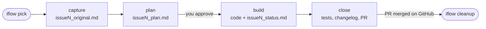
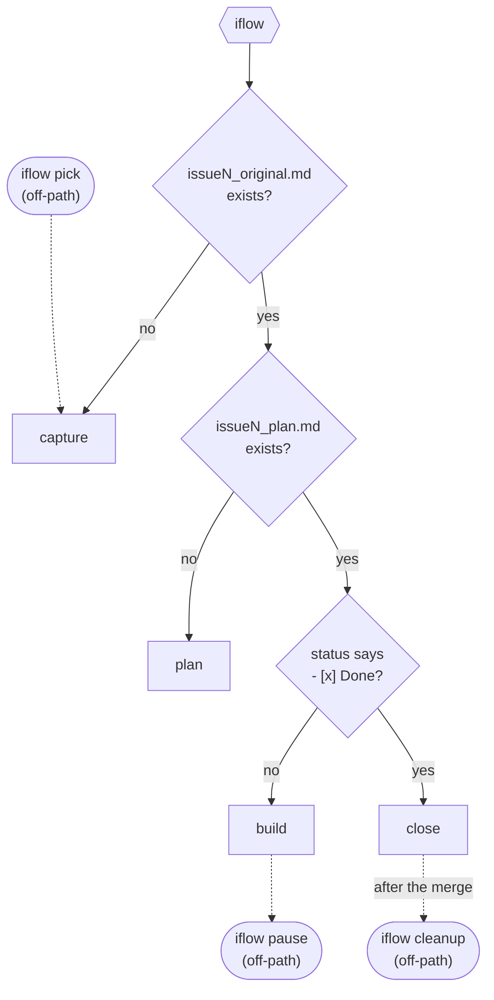
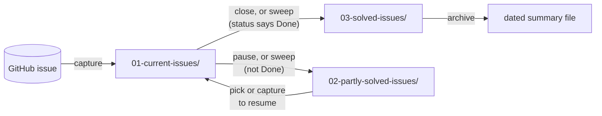
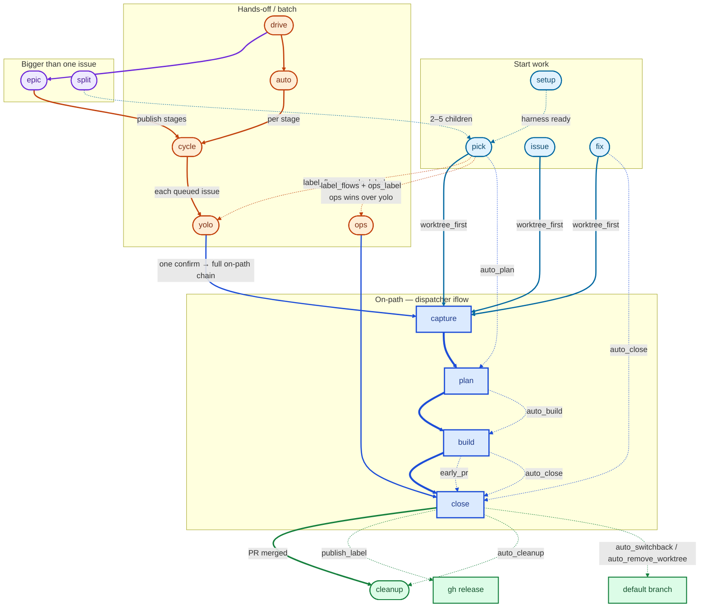

# Concepts

This page explains the ideas the rest of the docs take for granted: the issue
lifecycle, the `.issueflows/` folder, which commands run on their own and which
you must ask for, and where the agent always stops to ask you. Terms are
collected in the [glossary](#glossary) at the end.

## Commands and skills

issue-flow adds a set of **commands** to your editor: `/iflow`, `/iflow-plan`,
`/iflow-close`, and so on. Depending on the editor they are delivered as
*Agent Skills* (Cursor, Codex), as slash-command files (Claude Code,
opencode), or both. See [Editor support](editors.md). These docs call them all
**commands**.

Each command can be typed in three ways:

| Form | Example | When to use it |
| --- | --- | --- |
| Chat, with a space | `iflow plan` | Works everywhere; easiest on keyboards where `/` is awkward |
| Slash | `/iflow-plan` | From the editor's slash menu |
| Hyphen | `iflow-plan` | Also recognised |

Plain `iflow` (or `/iflow`) is the **dispatcher**: it works out which step comes
next and runs it.

## The lifecycle

One GitHub issue becomes one branch and one pull request. Each step writes or
moves a markdown file under `.issueflows/`, so the state of the work survives
across chat sessions and can be read by the next agent.



| Step | Command | What it writes or does |
| --- | --- | --- |
| Pick | `iflow pick` | Lets you choose an issue, creates the `<N>-<slug>` branch (in a sibling worktree by default), then runs capture |
| Capture | `iflow capture <N>` | `issue<N>_original.md`: the issue text from GitHub |
| Plan | `iflow plan` | `issue<N>_plan.md`: goal, constraints, approach, files, tests. **Stops for your approval** |
| Build | `iflow build` | Implements the approved plan. Starts `issue<N>_status.md` with `- [ ] Done` |
| Close | `iflow close` | Runs tests, adds a `HISTORY.md` entry, marks `- [x] Done`, moves the issue files, commits, pushes, opens a PR |
| Cleanup | `iflow cleanup` | After the PR is merged: switches to the default branch, pulls, deletes merged local branches |

If you lose track, type `iflow`. It looks at the **focus issue's** files and
dispatches:



Solid arrows are what `iflow` chooses; dotted ones are off-path commands you
run yourself. As a table:

| What exists | Next step |
| --- | --- |
| No `issue<N>_original.md` | capture |
| Original, but no plan | plan |
| Plan, and status is `- [ ] Done` or missing | build |
| Status says `- [x] Done` | close |

## The `.issueflows/` folder

```text
.issueflows/
  00-tools/                 helper scripts worth keeping, with a README index
  01-current-issues/        the focus issue only
  02-partly-solved-issues/  parked or unfinished issues
  03-solved-issues/         finished issues
  04-designs-and-guides/    durable project knowledge (this-project.md, decisions)
  05-epics/                 staged plans for large changes (epic<N>_plan.md)
```

An issue's files (`issue<N>_original.md`, `_plan.md`, `_status.md`) move as one
**group**:



- `iflow close` moves the focus issue when it is finished.
- `iflow pause` moves it to `02-` on purpose, with notes on what remains.
- `iflow capture` and `iflow build` **sweep** any *other* groups out of
  `01-current-issues/` the same way, so only the focus issue stays there.

`issue-flow init` and `issue-flow update` never touch these issue files, or
anything in `04-designs-and-guides/` that already exists.

## On-path and off-path commands

The **on-path** commands are the linear steps: capture, plan, build, close.
The dispatcher (`iflow`) chooses among only these four.

Everything else is **off-path**: you run it deliberately, and `iflow` never
starts it for you. That includes:

- `pick`, `issue`, `setup`, `init`, which create issues, branches or files;
- `pause`, `cleanup`, `archive`, which move or delete things;
- `yolo`, `cycle`, `auto`, `drive`, `fix`, `ops`, `epic`, `split`, `review`,
  which run hands-off or write to GitHub;
- `status`, `doctor`, `graphify`, which are helpers.

`iflow` may *mention* an off-path command (for example "run `iflow cleanup`
after the PR merges"), but it never runs one.

## Flows map

How the main entry points relate, and which **knobs** steer them. Thick arrows
are the on-path chain, medium arrows are the usual path, and thin dotted arrows
are opt-in or label-driven. Color marks the role; the key sits under the
diagram. Full knob list: [Configuration](configuration.md).



**Key.** Blue nodes start work. Deeper blue is the on-path chain (thick arrows).
Orange is hands-off. Purple is bigger than one issue. Green is the exit.
Medium solid arrows are the usual path; thin dotted arrows are opt-in knobs.

| Knob | Steers | Default |
| --- | --- | --- |
| `mode` | Which commands exist at all (`standard` / `novice` / `simple`) | `standard` |
| `worktree_first` | `pick` / `issue` / `fix` start in a sibling worktree vs `inplace` | `true` |
| `auto_plan` | After pick, chain into plan | `true` |
| `auto_build` | After plan approval, chain into build | `true` |
| `auto_close` | After build (or end of fix), chain into close | `false` |
| `early_pr` | Build opens a draft PR after the first push | `false` |
| `label_flows` | Pick routes by issue label (`yolo_label` → yolo, `ops_label` → ops) | `true` |
| `publish_label` | Close bumps + creates a GitHub release after merge | `"publish"` |
| `auto_cleanup` | After a PR exists, watch merge then run cleanup | `false` |
| `auto_switchback` | After close opens a PR, switch home to the default branch | `true` |
| `auto_remove_worktree` | Close removes the issue worktree when the tree is clean | `true` |
| `pr_merge_method` | How hands-off closes merge (`squash` / `merge` / `rebase`) | `squash` |
| `cycle_max_issues` / `cycle_onfail` / `cycle_nonyolo` | Cycle queue size, failure policy, non-yolo merge policy | `10` / `stop` / `merge` |
| `auto_adversarial_loops` | Auto review-and-fix loops per stage before it asks | `2` |
| `model_label_flows` | Pick announces deep/fast model from labels | `false` |

Per-run tokens (`inplace`, `worktree`, `noplan`, `nobuild`, `noearly`, …) override
the matching knob for that run only. See [Configuration](configuration.md) and
[Work in a sibling worktree](how-to/worktrees.md).

## Where the agent always stops to ask

The workflow is built so that nothing surprising happens without you seeing it
first:

- **Plans:** `iflow plan` stops until you approve the plan. `build` implements
  only an approved plan.
- **GitHub writes:** creating issues, labels or sub-issues (`issue`, `epic …
  publish`, `split`, `review`) happens behind a confirmation that shows exactly
  what will be created.
- **Deleting:** `cleanup` deletes only merged branches, behind one confirmation.
  Branches that need a force delete (`git branch -D`) get a **second**
  confirmation listing their tip SHAs. `archive` deletes files only after one
  consolidated confirmation.
- **Hands-off runs:** `yolo`, `cycle`, `auto` and `drive` ask **once, up
  front**, listing everything they will do. After that they stop only when
  input is really needed: failing tests, a refused merge, or a spec that turns
  out to be bigger than it looked.
- **Never:** force-pushing or rebasing the default branch, merging with admin
  override, or skipping CI.

With `--mode novice`, every step also stops and asks before chaining into the
next one. See [Choose a mode](how-to/choose-a-mode.md). If something does not
behave as described here, see [Troubleshooting](how-to/troubleshooting.md).

## Glossary

| Term | Meaning |
| --- | --- |
| **Adversarial review** | In [auto mode](how-to/auto-mode.md), a check after each epic stage: did the merged PRs really meet the stage goal? Gaps get issues reopened or new ones created. |
| **Command** | One of the `/iflow-*` actions. Delivered as a skill or a slash-command file depending on the editor. |
| **Dispatcher** | `iflow` with no step name. It reads the focus issue's files and runs capture, plan, build or close. |
| **Epic** | A change too big for one issue, planned as sequential **stages** of normal issues in `05-epics/epic<N>_plan.md`. See [Create and run epics](how-to/epics.md). |
| **Epoch** | One stage of an epic as run by auto mode: run the stage's issues, review, then decide whether to move to the next stage. |
| **Focus issue** | The issue currently being worked on: taken from the branch name `<N>-<slug>`, or else the single group in `01-current-issues/`. |
| **Harness** | The files issue-flow scaffolds into a project (skills, rules, `AGENTS.md` block, `.issueflows/`). `iflow init` checks or cold-starts it. |
| **Managed block** | The section of `AGENTS.md` (and similar shared files) between issue-flow's markers. `update` rewrites only that section and leaves the rest of the file alone. |
| **Mode** | Which set of commands is installed: `novice`, `simple`, or `standard`. See [Choose a mode](how-to/choose-a-mode.md). |
| **Noob** | A separate setting (`noob = true`) that prints a "what to do next" hint after each step. It does not change which commands are installed. |
| **Off-path** | A command `iflow` never runs for you; you ask for it explicitly. |
| **On-path** | The linear steps the dispatcher can choose: capture, plan, build, close. |
| **Parked** | An unfinished issue moved to `02-partly-solved-issues/`, usually by `iflow pause`. `iflow pick` offers parked work first. |
| **Skill level** | How opinionated the quality-tooling guidance is: `basic`, `standard`, or `advanced`. Independent of mode. |
| **Squash-landed branch** | A local branch whose PR was squash-merged. Its commits are not on the default branch, so `git branch -d` refuses it; `cleanup` offers `-D` behind a second confirmation. |
| **Stage** | One step of an epic: a group of issues published and finished together before the next stage starts. |
| **Sweep** | Moving issue groups other than the focus issue out of `01-current-issues/`, to `03-` if done and `02-` if not. |
| **Worktree-first** | The default start: a new issue gets a sibling folder `../<repo>-<N>` (a git worktree), so your main checkout stays on the default branch. See [Work in a sibling worktree](how-to/worktrees.md). |
| **Yolo** | A hands-off run for a small, low-risk issue: one confirmation, then plan, build, close and merge without further prompts. See [Fast-track a small issue](how-to/yolo.md). |
